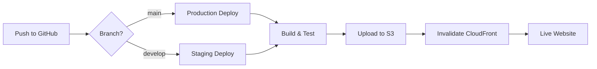

# EU Frontend Deployment Guide

## Overview

This project uses GitHub Actions for automated CI/CD deployment to AWS S3 + CloudFront. The deployment is triggered automatically when code is pushed to specific branches.

## Architecture

- **Hosting**: AWS S3 (Static Website)
- **CDN**: AWS CloudFront
- **CI/CD**: GitHub Actions
- **Infrastructure**: Terraform (IaC)

## Deployment Flow



## Automated Deployment via GitHub Actions

### Deployment Triggers

- **Production**: Push to `main` branch → Deploys to production environment
- **Staging**: Push to `develop` branch → Deploys to staging environment
- **PR Checks**: All pull requests run tests and build checks

### GitHub Secrets Required

Configure these secrets in your GitHub repository settings:

```bash
# AWS Deployment Role (using OIDC)
AWS_DEPLOY_ROLE_ARN

# S3 Buckets
PROD_S3_BUCKET
STAGING_S3_BUCKET

# CloudFront Distribution IDs
PROD_CLOUDFRONT_DISTRIBUTION_ID
STAGING_CLOUDFRONT_DISTRIBUTION_ID

# API URLs
PROD_API_URL
STAGING_API_URL

# Analytics (optional)
GA_TRACKING_ID
```

## Initial Setup

### 1. AWS Infrastructure Setup

First, set up the AWS infrastructure using Terraform:

```bash
# Navigate to infrastructure directory
cd infrastructure/terraform

# Initialize Terraform
terraform init

# Create staging environment
terraform plan -var-file=environments/staging.tfvars
terraform apply -var-file=environments/staging.tfvars

# Create production environment
terraform plan -var-file=environments/production.tfvars
terraform apply -var-file=environments/production.tfvars
```

### 2. Configure AWS IAM for GitHub Actions

Create an IAM role for GitHub Actions with OIDC provider:

```json
{
  "Version": "2012-10-17",
  "Statement": [
    {
      "Effect": "Allow",
      "Principal": {
        "Federated": "arn:aws:iam::YOUR_ACCOUNT_ID:oidc-provider/token.actions.githubusercontent.com"
      },
      "Action": "sts:AssumeRoleWithWebIdentity",
      "Condition": {
        "StringEquals": {
          "token.actions.githubusercontent.com:aud": "sts.amazonaws.com",
          "token.actions.githubusercontent.com:sub": "repo:YOUR_GITHUB_ORG/eu-frontend:ref:refs/heads/*"
        }
      }
    }
  ]
}
```

Attach this policy to the role:

```json
{
  "Version": "2012-10-17",
  "Statement": [
    {
      "Effect": "Allow",
      "Action": [
        "s3:ListBucket",
        "s3:GetObject",
        "s3:PutObject",
        "s3:DeleteObject"
      ],
      "Resource": [
        "arn:aws:s3:::eu-frontend-*",
        "arn:aws:s3:::eu-frontend-*/*"
      ]
    },
    {
      "Effect": "Allow",
      "Action": [
        "cloudfront:CreateInvalidation"
      ],
      "Resource": "*"
    }
  ]
}
```

### 3. Configure GitHub Repository

1. Go to Settings → Secrets and variables → Actions
2. Add all required secrets listed above
3. Ensure branch protection rules are set for `main` and `develop`

## Deployment Process

### Automatic Deployment

1. **Development Work**
   ```bash
   git checkout -b feature/new-feature
   # Make changes
   git add .
   git commit -m "feat: add new feature"
   git push origin feature/new-feature
   ```

2. **Create Pull Request**
   - PR automatically runs tests and build checks
   - Lighthouse CI runs performance tests
   - Security scans are performed

3. **Merge to Staging**
   ```bash
   # After PR approval
   git checkout develop
   git merge feature/new-feature
   git push origin develop
   # Automatically deploys to staging
   ```

4. **Deploy to Production**
   ```bash
   # After staging verification
   git checkout main
   git merge develop
   git push origin main
   # Automatically deploys to production
   ```

### Manual Deployment (Emergency Only)

If needed, you can trigger deployment manually:

```bash
# Using the deployment script
./scripts/deploy.sh staging
# or
./scripts/deploy.sh production
```

## Environment URLs

- **Production**: https://euholidays.com.sg
- **Staging**: https://staging.euholidays.com.sg

## Monitoring Deployments

### GitHub Actions Dashboard

Monitor deployment status at:
- https://github.com/YOUR_ORG/eu-frontend/actions

### CloudFront Invalidation

Check invalidation status:
```bash
aws cloudfront get-invalidation \
  --distribution-id YOUR_DISTRIBUTION_ID \
  --id YOUR_INVALIDATION_ID
```

## Rollback Procedure

### Quick Rollback via GitHub

1. Go to the Actions tab in GitHub
2. Find the last successful deployment
3. Click "Re-run all jobs"

### Manual Rollback

```bash
# Revert to previous commit
git revert HEAD
git push origin main

# Or reset to specific commit
git reset --hard COMMIT_HASH
git push --force-with-lease origin main
```

## Troubleshooting

### Build Failures

1. Check GitHub Actions logs
2. Common issues:
   - Missing environment variables
   - TypeScript errors
   - ESLint violations

### Deployment Failures

1. Verify AWS credentials in GitHub Secrets
2. Check S3 bucket permissions
3. Verify CloudFront distribution ID

### Cache Issues

Force cache invalidation:
```bash
aws cloudfront create-invalidation \
  --distribution-id YOUR_DISTRIBUTION_ID \
  --paths "/*"
```

## Cost Optimization

- CloudFront is configured with `PriceClass_200` (excludes expensive regions)
- S3 versioning is enabled for rollback capability
- Static assets cached for 1 year
- HTML files cached for 0 seconds (always fresh)

## Security Best Practices

1. All secrets stored in GitHub Secrets (never in code)
2. S3 buckets are private (access only via CloudFront)
3. HTTPS enforced via CloudFront
4. Security headers configured in CloudFront
5. Automated security scanning in PR checks

## Local Development

```bash
# Install dependencies
npm install

# Run development server
npm run dev

# Build locally
npm run build

# Test static export
npm run export
```

## Support

For deployment issues:
1. Check GitHub Actions logs
2. Review AWS CloudWatch logs
3. Contact DevOps team